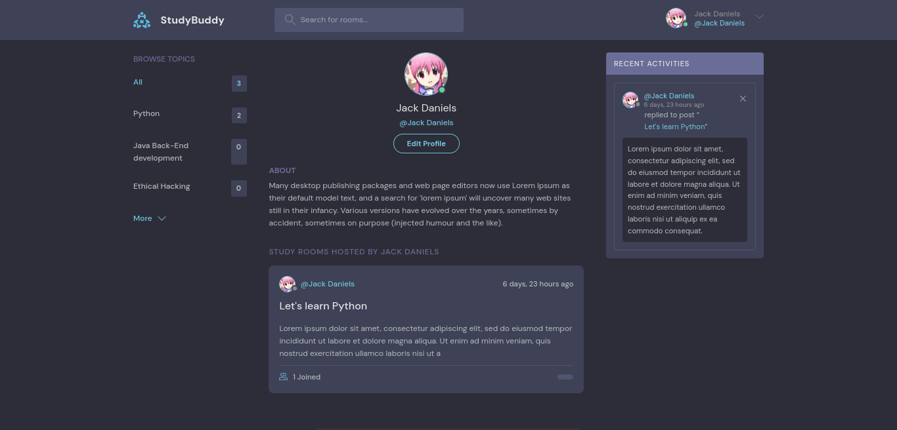
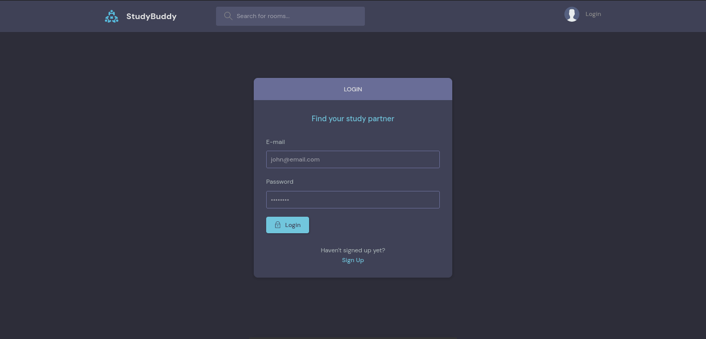

# StudyBuddy
Projeto de um fórum desenvolvido com Django, em um curso do YouTube, originalmente na versão 3.x que estou atualizando para a versão 5.x

## Origem do curso
https://www.youtube.com/watch?v=PtQiiknWUcI

## Screenshots

